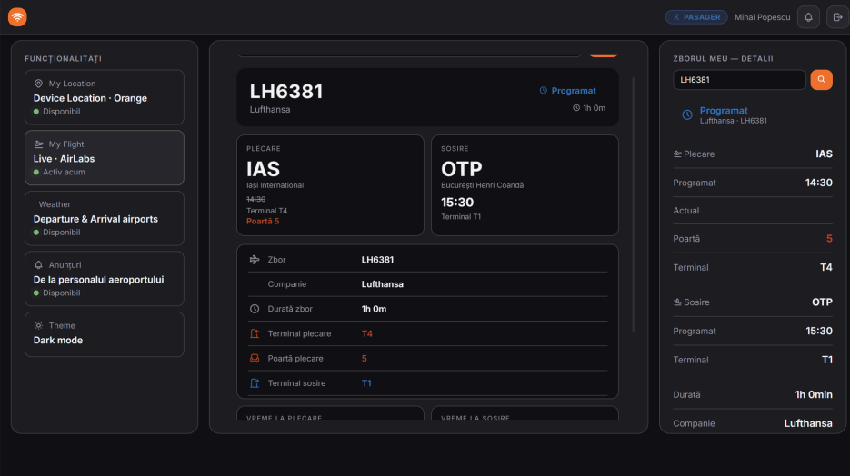
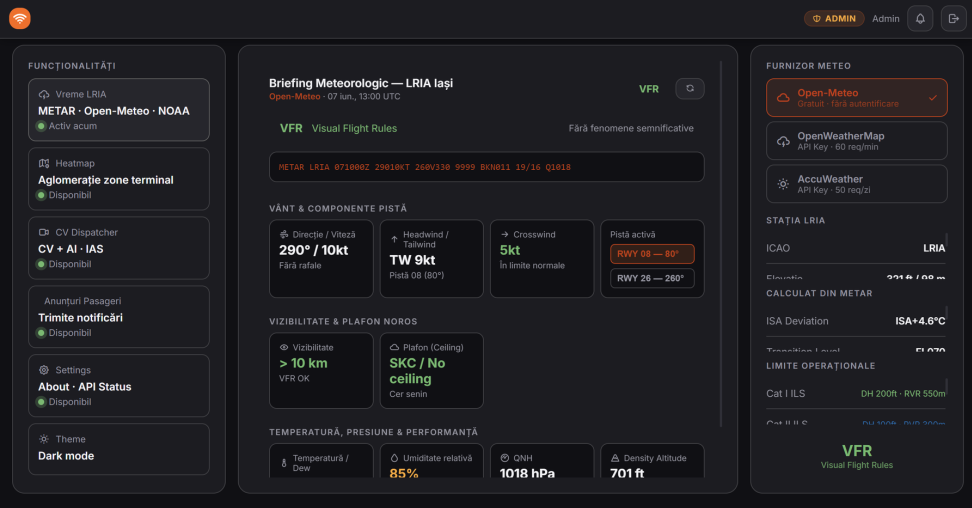
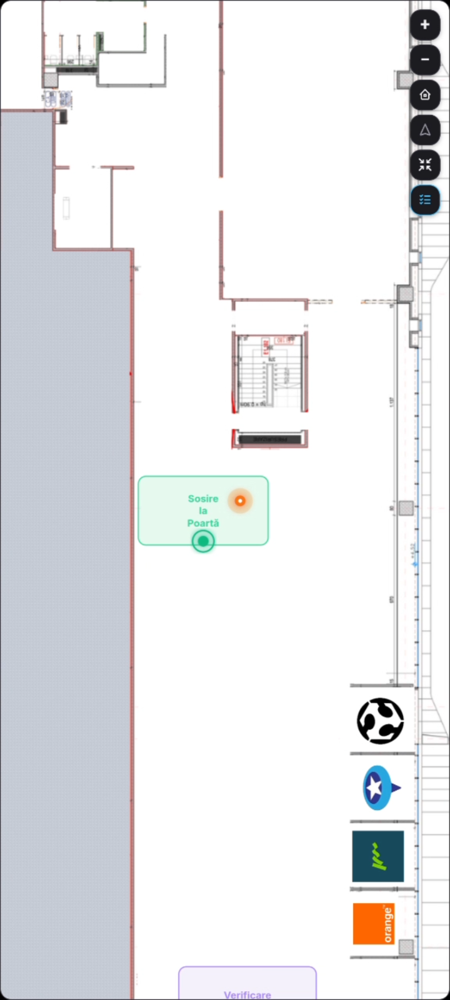
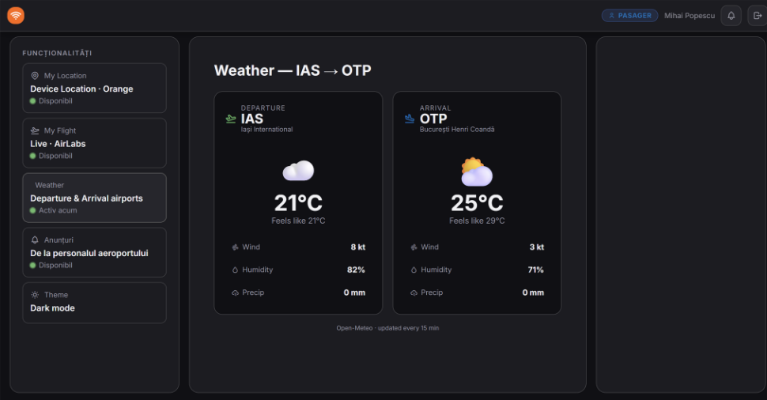
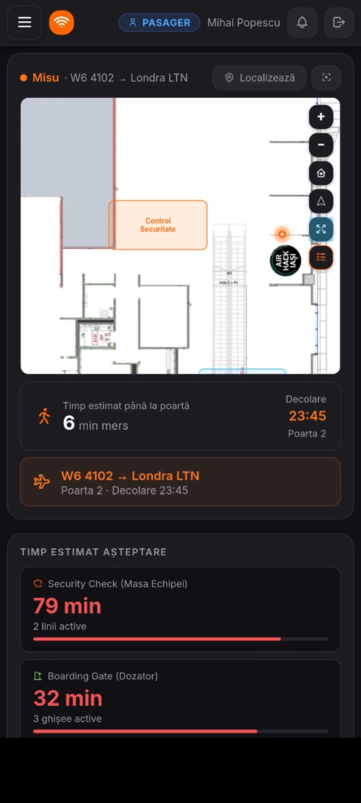
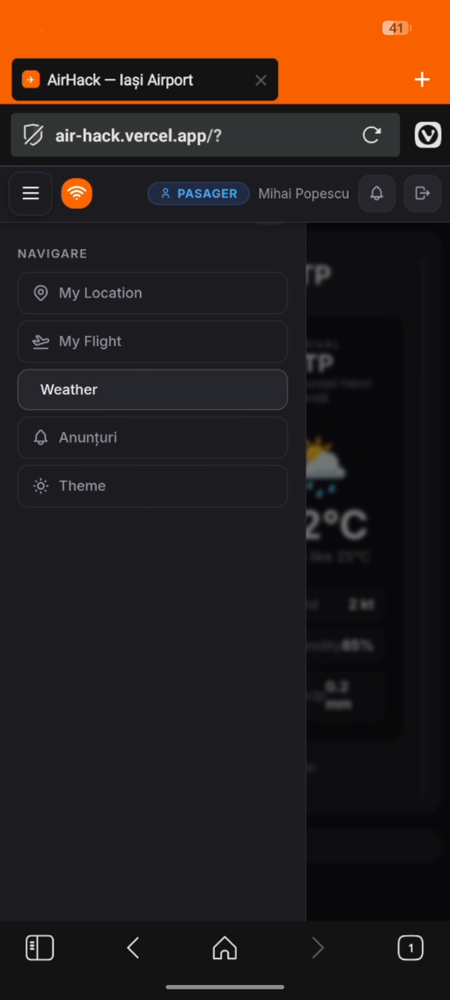

# AirFlow Nexus

**2nd place at AirHack 2025 — Iași International Airport (LRIA/IAS)**

**Team:** Vleju Cosmin Eugen (lead), Ignat Andrei, Moisa Gabriel, Romila Nicolae

---

<p align="center">
  
  
  
  
  <br>
  
  
</p>

---

## What's this?

We built a dashboard for Iași airport that helps both staff and passengers see what's happening in real time. It watches security cameras with YOLO to count people, pings an LLM to flag bottlenecks, shows live flights and weather, and guides passengers through the terminal on an indoor map.

### Staff side

- **CV Dispatcher** — live video feeds with person detection across 3 zones (Gate, Check-In, Disembarkation). Shows occupancy, trends, and alerts.
- **AI Dispatcher** — Gemini analyzes crowd data and suggests what to do (open another lane, redirect staff, etc.). Works offline with a rules fallback.
- **Heatmap** — population density from Orange CAMARA device data.
- **Announcements** — broadcast to all passengers in real time via SSE.
- **Weather** — full METAR breakdown, headwind/crosswind for runways 08/26, density altitude, fog risk.

### Passenger side

- **My Location** — indoor map with GPS calibration, pinch-to-zoom, and a step-by-step boarding guide (Check-In → Security → Documents → Gate → Boarding).
- **My Flight** — live schedule, gate, and status.
- **Weather** — departure and arrival airport weather.

---

## Tech used

Astro 6, React 19, TypeScript, Tailwind CSS 4, Chart.js, Google Gemini, YOLOv8 + ByteTrack, Flask MJPEG, AirLabs, NOAA METAR, Open-Meteo, Orange CAMARA

Deployed on Vercel.

---

## Running it

```bash
npm install
cp .env.example .env    # USE_FIXTURES=true for demo mode (no API keys needed)
npm run dev              # http://localhost:4321

# Optional: computer vision pipeline
cd video_analytics
pip install ultralytics flask
python stream_server.py &
python process_streams.py &
```

---

## About the hackathon

AirHack was organized by Iași International Airport. We won **2nd place** — huge shoutout to the team for grinding through the weekend.

---

## Screenshots

### Passenger Dashboard


### Employee Dashboard — METAR Weather Briefing


### Indoor Passenger Wayfinding Map


### Passenger Weather View


### Mobile — Map View


### Mobile — Menu

